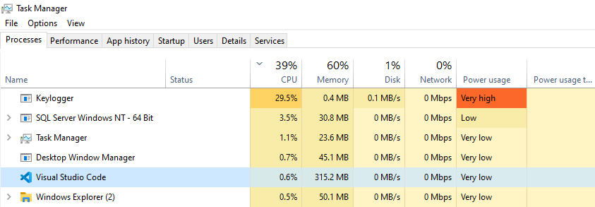

# Keylogger
Keyloggers are built for the act of keystroke logging — creating records of everything you type on a computer or mobile keyboard. These are used to quietly monitor your computer activity while you use your devices as normal. Keyloggers are used for legitimate purposes like feedback for software development but can be misused by criminals to steal your data.
## Legal disclaimer:
Usage of Keylogger for attacking targets without prior mutual consent is illegal. It's the end user's responsibility to obey all applicable local, state and federal laws. Developers assume no liability and are not responsible for any misuse or damage caused by this program 

## How to Detect K E Y L O G G E R
Avoid keyloggers by avoiding the user mistakes that lead to their ability to infect phones and computers. It starts with keeping your operating system, your applications, and web browsers up to date with the latest security patches. Always be skeptical about any attachments you receive, especially unexpected ones even if they seem to come from someone you know. When in doubt, contact the sender to ask. Keep your passwords long and complex, and avoid using the same one for different services.

Real-time, always-on anti-malware protection is the gold standard for preventing not only infection from a keylogger, but also from all other associated malware threats. For all platforms and devices, from Windows and Android, Mac and iPhones, to business environments, Malwarebytes is a first-line defense against the relentless onslaught of cybercriminal attacks.
